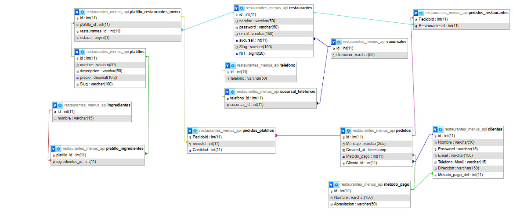

# Menus para restautantes

Proyecto para campus, una plataforma donde los restautantes puedan crear sus menus y sus comensales, puedan realizar pedidos, todo atraves de la api de whatsapp

ejemplo para el mensaje

Hola, quiero una hamburguesa 🍔
📍Giron, Barrio el poblado #74-58
📱3194xxxxx
✋Luis Fernando
<link__>
por favor sin cebolla, salsa piña

#### link de whatsapp

```https

https://api.whatsapp.com/send?phone=573173420342&text=Hola%20estoy%20quiero%20una%20hamburguesa%20%F0%9F%8D%94%0A%F0%9F%93%8DGiron%2C%20Barrio%20el%20poblado%20%2374-58%0A%F0%9F%93%B13194xxxxx%0A%E2%9C%8BLuis%20Fernando%0A%3Clink__%3E%0Apor%20favor%20sin%20cebolla%2C%20salsa%20pi%C3%B1a

```

# Objetivos

### Objetivo general

Crear un backend para la aplicacion, que permina a restautantes crear sus menus y a sus clientes realizar sus pedidos por medio de whatsapp

### Objetivos Especificos

* Crear roles en la eplicacion
* Craer el diagrama MER de la base de datos
* Connectar el backend con la api de whatsapp
* Crear plantillas para el envio de los mensajes
* Especificar las rutas de la aplicacion
* Crear validaciones para las entradas de datos


### Diagrama MER



## 🛠 Tecnologias
Node, Express, Mysql

## 🔗 Links
[](https://dannkol.github.io/portafolios/)
[](https://www.linkedin.com/in/daniel-manosalva-000b98242)


## API Reference

## Restaurantes

Cada Restaurante tiene su propio menu, pueden realizar todas las acciones de un CRUD

#### Get all platillos (Menus)


```http
  GET /api/auth/restaurante/menu
```

| Parameter | Type     | Description                |
| :-------- | :------- | :------------------------- |
| `api_key` | `string` | **Required**. Your API key |

Responde 

```json
{
    "mensaje" : "Menu del restaurante 1",
    "data" : [
        {
            "nombre" : "pasta con carne",
            "precio" : 12.000,
            "descripcion" : "pastas con carne y sabor a verduras"
        },
        {
            "nombre" : "pasta con verduras",
            "precio" : 10.000,
            "descripcion" : "pastas con verduras"
        },
    ]
}
```

### Crear platillos y menus

#### CRUD ingredientes 

#### Get ingredientes

```http
GET /api/auth/restaurante/menu/ingredientes
```

| Parameter | Type     | Description |
| :-------- | :------- | :------------ |
| `api_key`      | `string` | **Required**.  |

Responde

```json
{
    "mensaje" : "Ingredientes",
    "data" : [
        {
            "nombre" : "Tomate"
        },
        {
            "nombre" : "Tomate grille"
        }
    ]
}
```

#### Post ingredientes

```http
POST /api/auth/restaurante/menu/ingredientes
```

| Parameter | Type     | Description |
| :-------- | :------- | :------------ |
| `api_key`      | `string` | **Required**.  |
| `nombre`  | `string` | **Required** |

Request

```json
{
    "nombre" : "tomate"
}
```

Responde

```json
{
    "nombre" : "Ingredientes agregado"
}
```

#### Put ingredientes para uctualizar ingredientes

```http
PUT /api/auth/restaurante/menu/ingredientes/{id}
```

| Parameter | Type     | Description |
| :-------- | :------- | :------------ |
| `id`      | `number` | **Required**.  |
| `api_key`      | `string` | **Required**.  |
| `nombre`  | `string` | **Required** |

Request

```json
{
    "nombre" : "tomate grill"
}
```

Responde

```json
{
    "nombre" : "Ingrediente actualizados"
}
```

#### Delete ingredientes para uctualizar ingredientes

```http
DELETE /api/auth/restaurante/menu/ingredientes/{id}
```

| Parameter | Type     | Description |
| :-------- | :------- | :------------ |
| `id`      | `number` | **Required**.  |
| `api_key`      | `string` | **Required**.  |

Responde

```json
{
    "nombre" : "Ingrediente Eliminado"
}
```

### CRUD Platillo

#### Get platilos

```http
  GET /api/auth/restaurante/menu
```
| Parameter | Type     | Description |
| :-------- | :------- | :------------ |
| `api_key`      | `string` | **Required**.  |

pormedio del api_key se trae el platillo del restaurante

Responde

```json
{
    "mensaje" : "Platillos",
    "data" : [
        {
            "nombre" : "papas fritas",
            "precio" : 3.000,
            "descripcion" : "papas fritas de las calles"  
        },
        {
            "nombre" : "pasta",
            "precio" : 12.000,
            "descripcion" : "pasta boloñesa" 
        }
    ]
}
```

#### Post platilos crea nuevos menus

```http
  POST /api/auth/restaurante/menu
```
pormedio del api_key se oscia el platillo al restaurante

| Parameter | Type     | Description |
| :-------- | :------- | :------------ |
| `api_key`      | `string` | **Required**.  |
| `nombre` | `string`| **Required** |
| `precio` | `number`| **Required** |
| `descripcion` | `string`| **Required** |
| `slug` | `string`| nombre + random_number |
| `ingredientes` | `array` | **Required** |


Request

```json
{
    "nombre" : "papas fritas",
    "precio" : 3.000,
    "descripcion" : "papas fritas de las calles",
    "ingredientes" : [
        1,2
    ],// array con los id de los ingredientes 
}
```

Responde

```json
{
    "mensaje" : "Platillo creado"
}

```
#### Put platilos

```http
  PUT /api/auth/restaurante/menu/{id}
```
| Parameter | Type     | Description |
| :-------- | :------- | :------------ |
| `api_key`      | `string` | **Required**.  |
| `id`      | `numbre` | **Required**.  |
| `nombre` | `string`| **Required** |
| `precio` | `number`| **Required** |
| `descripcion` | `string`| **Required** |
| `slug` | `string`| nombre + random_number |
| `ingredientes` | `array` | **Required** |

Request

```json
{
    "nombre" : "papas fritas",
    "precio" : 3.000,
    "descripcion" : "papas fritas de las calles",
    "ingredientes" : [
        1,2
    ],// array con los id de los ingredientes 
}
```

Responde

```json
{
    "mensaje" : "Platillo actualizado"
}
```
#### Delete platillo

```http
  DELETE /api/auth/restaurante/menu/{id}
```
| Parameter | Type     | Description |
| :-------- | :------- | :------------ |
| `api_key`      | `string` | **Required**.  |
| `id` | `string` | **Required**.  |


Responde
```json
{
    "mensaje" : "Platillo eliminado"
}
```

## Cientes

los clientes pueden realizar pedidos, estos pueden estar registrados o ser ananonimos, al realizar un pedido, este se relaciona al usuario si esta logueado y tambien se relaciona al restaurante sin importar si esta logueado o no


#### Post realizar un pedido

```http
POST /api/pedido
```

| Parameter | Type     | Description |
| :-------- | :------- | :------------ |
| `api_key` | `string` | **Opcional**  |
| `platillo` | `number` | **Required**. |
| `cantidad` | `number` | **Required**. |
| `metodo_pago` | `number` | **Required**. |
| `nombre` | `string` | **Opcional**  |
| `direccion` | `string` | **Opcional**  |
| `tel` | `string` | **Opcional**  |
| `opciones` | `array` | **Opcional**  |


por medio del platillo se sabe a que restaurante esta asosiado y de esta manera se asosia el pedido a un restaurante

#### Usuario ya registrado

En caso dee que el usuario ya este registrado, se usara su info para crear el link de whatsapp.

Request

```json
{
    "platillo" : 1,
    "cantidad" : 2,
    "metodo_pago" : 2
}
```
#### Usuario no registrado

Request

```json
{
    "platillo" : 1,
    "cantidad" : 2,
    "metodo_pago" : 2,
    "nombre" : "Daniel",
    "direccion" : "Giron, Barrio el poblado #74-58",
    "tel" : "3194xxxxx",
    "opciones" : [ 1, 2] // los ingredientes que no quiere en el pedido
}
```

Responde

```json
{

    "mensaje" : "Pedido enviado al restaurante",
    "whatsapp" : "https://api.whatsapp.com/send?phone=573173420342&text=Hola%20estoy%20quiero%20una%20hamburguesa%20%F0%9F%8D%94%0A%F0%9F%93%8DGiron%2C%20Barrio%20el%20poblado%20%2374-58%0A%F0%9F%93%B13194xxxxx%0A%E2%9C%8BLuis%20Fernando%0A%3Clink__%3E%0Apor%20favor%20sin%20cebolla%2C%20salsa%20pi%C3%B1a"

}
```

#### Post Creacion de un usuario

con este endpoint se pueden registrar los usuario

```http
POST /api/usuario/login
```
| Parameter | Type     | Description |
| :-------- | :------- | :------------ |
| `email` | `string` | **Required**. |
| `password` | `string` | **Required**. |
| `metodo_pago` | `number` | **Required**. |
| `nombre` | `string` | **Required**  |
| `direccion` | `string` | **Required**  |
| `tel` | `string` | **Required**  |

Request 

```json
{
    "email" : "correo@correo.com",
    "password" : "dew223",
    "metodo_pago" : 3,
    "nombre" : "Daniel",
    "direccion" : "Giron, Barrio el poblado #74-58",
    "tel" : "3194xxxxx"
}
```

Responde

```json
{
    "mensaje" : "Usuario registrado"
}
```